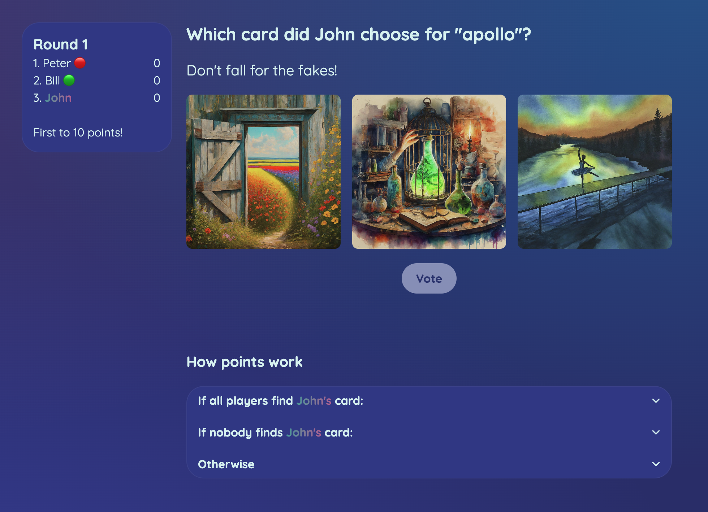

# talespin
Talespin (inspired by [Dixit](https://en.wikipedia.org/wiki/Dixit_(board_game))) is a simple-to-learn card game that emphasizes creativity and abstract thinking.


<p align="center">
<a href="https://talespin.live">
<br>
<strong>talespin.live</strong>
</a>
</p>

The server is written in Rust using the Axum web framework and a number of awesome tools (anyhow, dashmap, serde_json, tokio). The client-side is written in Svelte with Skeleton UI. Communicaton between the client-side and server-side is primarily handled through websockets with a central server that stores state in-memory, meaning that any latency is introduced by the network.

## Development

Install frontend dependencies:

```bash
npm install
```

Run the frontend locally:

```bash
npm run dev
```

Run the backend:

```bash
cd dixit-server && cargo run
```

## Vertical Scaling

The server uses Rust + Tokio async runtime, which can handle hundreds of thousands to millions of concurrent WebSocket connections on a single node with proper OS tuning.

### OS Configuration (Linux)

```bash
# Max open files per process (each connection = 1 fd, default ~1024)
ulimit -n 2000000

# System-wide file descriptor limit
sysctl -w fs.file-max=2000000

# Max queued connections waiting for accept() (default 128)
sysctl -w net.core.somaxconn=65535

# Max half-open TCP connections during handshake (default ~1024)
sysctl -w net.ipv4.tcp_max_syn_backlog=65535

# Max packets queued at NIC before kernel processes them (default ~1000)
sysctl -w net.core.netdev_max_backlog=65535
```

### Estimated Capacity

- **100K connections** - Minimal tuning, 4GB+ RAM
- **500K connections** - OS tuning above, 8GB+ RAM
- **1M+ connections** - Full tuning, 16GB+ RAM

Memory usage is roughly 5-10 KB per connection (Tokio task + WebSocket state + application state).
